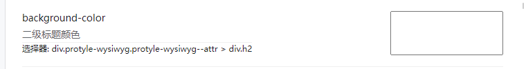

[English](https://github.com/leolee9086/themeEditor/blob/master/README_en_US.md)

# themeEditor使用方法

## 安装：

通过集市安装或者通过压缩包安装。

## 使用：

插件启用后应当会生成一个侧边栏按钮，点击后将会打开插件的主面板。

### 设置项目说明：

#### 主题配置

主题配置文件和产品均只能在对应名称主题下启用。

配置产品只能在对应名称主题的对应配置文件下启用。

##### 当前主题配置文件：

如果你使用的主题提供了配置文件，将可以在此处选择。

主题配置文件**不能在插件内增加或者删除**，如果有需要自行修改的，可以参考下面的配置文件编写指南。

##### 当前主题配置产品：

不要问我为啥叫产品，其实我也不知道，就随便写了一个名字而已。

配置产品是计算生成的css文件。

每个配置文件可以对应多个配置产品。

#### 公共配置

公共配置文件在各个主题下都会生效。

公共配置文件可以有多个，目前不提供编辑功能，只能上传（仅仅在安全上文内）或者下载。

### 配置过滤

可以以关键词、配置源、分组、选择器等对配置项的显示或者生效进行过滤。

#### 真实过滤

没有开启真实过滤时，配置项过滤仅仅是界面显示效果。

开启真实过滤后，只有显示的配置项会生效。

### 配置产品导出

主题配置产物和公共配置产物可以分别下载。

可以点击界面上的`+`​符号增加配置产品。

左键点击界面上形如`<-->`的符号会将**当前界面上显示的配置结果**（不是配置产品的内容）提交到代码片段并启用。

右键将会删除它。

生成的主题代码片段仅会在主题匹配时生效。

需要注意的是代码片段生成的css值**并不会**被插件自动识别,所以界面上的属性可能跟当前代码片段的值不一样。

代码片段与对应的配置文件绑定，多个配置文件可以生成多个不同的代码片段并且启用

当代码片段存在时，配置文件后的按钮颜色会有一些变化。

## 配置文件编写说明

### 主题配置文件

主题需要在theme.json中增加config项来启用配置文件适配。

例如：

```json
{
	"config":["config.json"]
}
```

是一个合法的配置文件项声明。

同样的：

```json
{
	"config":"config.json"
}
```

也是可以的。

如果有多个配置文件请使用上面的形式，采用逗号（`,`​）隔开的字符串**不会**被识别为多个配置文件，可能会造成问题。

### 公共配置文件

公共配置文件全部位于`**data\storage\petal\themeEditor\commonConfigs**`​文件夹里内部。

暂时不提供删除功能。

插件自带有`difaultConfig.js`​配置文件，这个文件每次启动插件都会被重写，不要在这个文件里写你自己需要的配置。

### 配置文件格式

配置文件接受`.json`​与`.js`以及`.css`​文件格式。

可以使用对象或者数组来声明配置规则

这是一个合法的配置文件

```js
[
  {
    "name": "--b3-theme-background",
    "type": "color",
    "label": "背景色",
    "memo": "",
    "default":"red"//default项缺省时会尝试从相关css文件解析
  }
]
```

等价于：

```js
{
   "--b3-theme-background":{
    "type": "color",
    "label": "背景色",
    "memo": "",
    "default":"red"
  }
}
```

使用js声明配置文件时,仅支持`esm`​,并请将配置规则以`default`​导出,例如:

```js
let 系统字体列表 =(await((await fetch(
    '/api/system/getSysFonts',
    {
        method:'post',
        body:'{}'
    }
)).json())).data

export default {
    "--b3-font-family":{
        label:'字体样式',
        type:'select',
        multiple:true,
        options:系统字体列表,
        subtype:"fonts"
    },
    "--b3-theme-background":{
        label:'背景色',
        type:'color',
      
    }
}
```

> 为了你的身心健康考虑，请**不要**使用它作为`theme.js`​的替代。

一个css文件也是一个可用的配置文件,插件会尝试将css解析为json配置文件。

目前对css配置文件的解析存在一定不足，如果发现问题可以提交issue或者直接发起pr。

需要注意的是css中的@import规则在配置中仅支持`@import url(foo)；`的形式，并在界面生成开关。

### 配置项目说明

配置项目前可以声明的`type`​有这些

* string:一个字符串
* color：颜色

  * 接受各种格式的颜色，但是输出为rgba
* number：数字

  * max：最大值
  * min：最小值
  * unit： 单位，默认为px
* select：选择器

  * subtype为font时会自行渲染字体样式
  * multiple属性指定是否多项选择
* boolean：布尔值

其他属性有：

* name：属性名称，使用css写法，不要使用驼峰命名，例如`background-color`​​​不要写作`backgroundColor`​​​。
* label：显示作为配置项说明文字。
* group：分组
* selector：配置项的目标选择器，默认为`:root`​（便于用来声明css变量）
* subGroup：次级分组
* memo：备用属性
* render：如果需要使用自定义渲染函数，请将`type`​​属性留空：

  * ```js
     {
        name: "background-color",
        //type: "color",
        label: "二级标题颜色",
        memo: "",
        group: "编辑器",
        subGroup:"标题",
        selector:" div.protyle-wysiwyg.protyle-wysiwyg--attr > div.h2",
        render:(options)=>{
          let element = document.createElement('input')
          return element
        }
      }
    ```
  * 渲染为：

    * ​​
  * 如果使用渲染函数，需要保证：

    * 1. 返回值为一个DOM元素
      2. 这个元素必须在值改变时触发change事件
  * 另外：

    * 渲染函数传入的两个参数分别为声明规则自身以及所在的表单项。
    * 表单项的DOM可以通过`formItem.element`​​来修改，但即使如此，你依然要返回一个输入元素，并保证它的值改变时触发`change`​​事件

### css变量

当声明的值为一个css变量时，调节这个属性将会直接改动对应选择器内的css变量声明，而不是改动`name`​对应的css属性值。

## 感谢：

pickr：[Simonwep/pickr: 🎨 Flat, simple, multi-themed, responsive and hackable Color-Picker library. No dependencies, no jQuery. Compatible with all CSS Frameworks e.g. Bootstrap, Materialize. Supports alpha channel, rgba, hsla, hsva and more! (github.com)](https://github.com/Simonwep/pickr)

​​libarchivejs​：[nika-begiashvili/libarchivejs: Archive library for browsers (github.com)](https://github.com/nika-begiashvili/libarchivejs)

## 捐赠：

如果它对你有用，可以给我买一杯咖啡

[leolee9086正在创作一些简单的技术教程和小工具,以及设计方面内容 | 爱发电 (afdian.net)](https://afdian.net/a/leolee9086)

我对GitHub使用不太熟悉，平时也有其他工作要做，如果没有及时回复issue还请见谅。